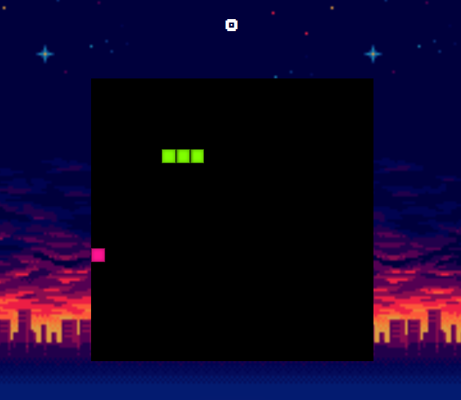

# Snake Game JS

This is my first project using Javascript, CSS and HTML Canvas where I recreated the classical Snake game. This project was a great way to apply my skills for the first time and I got to learn a lot about HTML Canvas. 

There is a problem with the snake bypassing the boundaries when you move it quickly in a certain way and there is also an animation delay on the snake when it is game over.

## How to play the game

You can play it on https://snakejsnfalck.netlify.app/!
You use the arrows keys to move the snake and the goal is to get many fruits without colliding in the walls or the snake's own tail. 

## Credits
Since I didn't have any experience with HTML Canvas before, I took some help from Kenny Yip Coding's [tutorial](https://www.youtube.com/watch?v=baBq5GAL0_U). I also used Kevin Powell's [video](https://www.youtube.com/watch?v=TAB_v6yBXIE) on how to make a popup modal. 

- Background by [ansimuz](http://ansimuz.com/site/)
- Font by [Rick Hoppmann](https://www.tinyworlds.org/)
- Sound effect by https://wobbleboxx.com/ 
